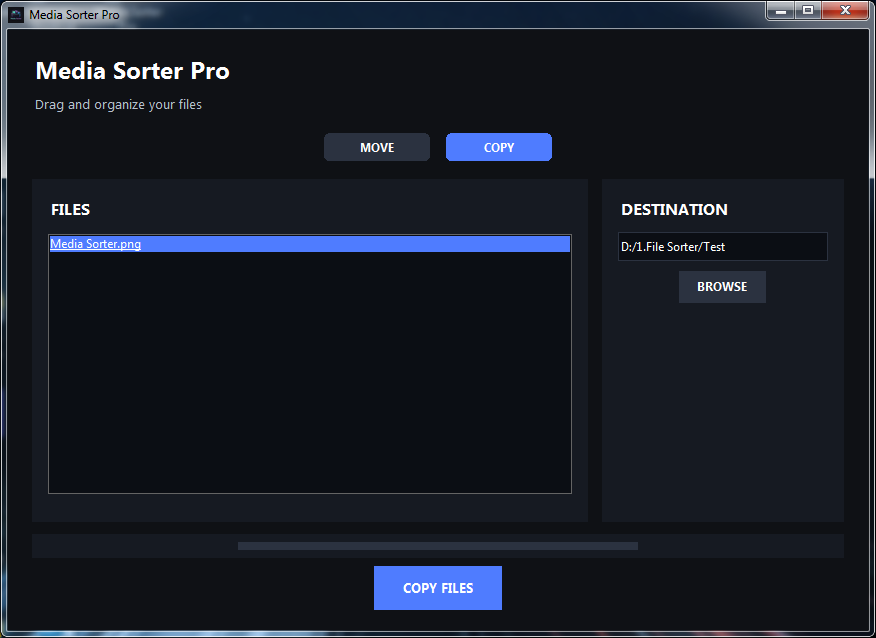
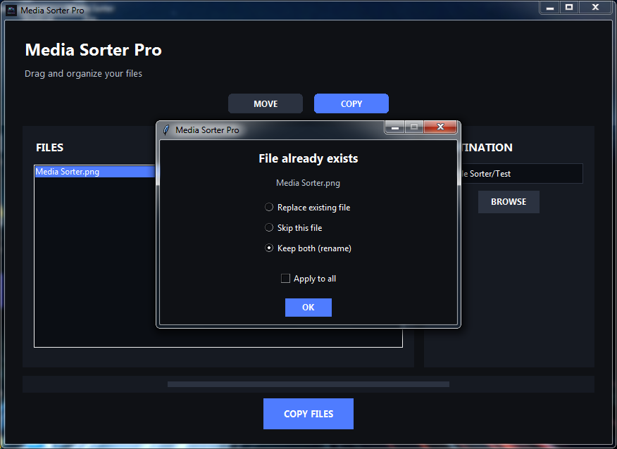

# 📁 Media Sorter Pro

**Media Sorter Pro** is a modern, dark-themed Windows desktop application built with Python and Tkinter that allows you to **move or copy files quickly and safely**, with conflict handling, progress tracking, and drag-and-drop support.

Designed to work smoothly even on **older Windows systems**.

---

## ✨ Features

- 🌓 Modern dark UI
- 📂 Drag & drop files into the app
- 🔁 Move or Copy modes
- ⚠️ Smart conflict handling:
  - Replace existing file
  - Skip file
  - Keep both (auto-rename)
  - “Apply to all” option
- 📊 Real-time progress bar
- 💾 Remembers last destination folder
- 🖼 Custom app icon (taskbar + title bar)
- 🧵 Thread-safe UI (no freezes)
- 🪟 Proper Windows installer support

---

## 📷 Screenshots

